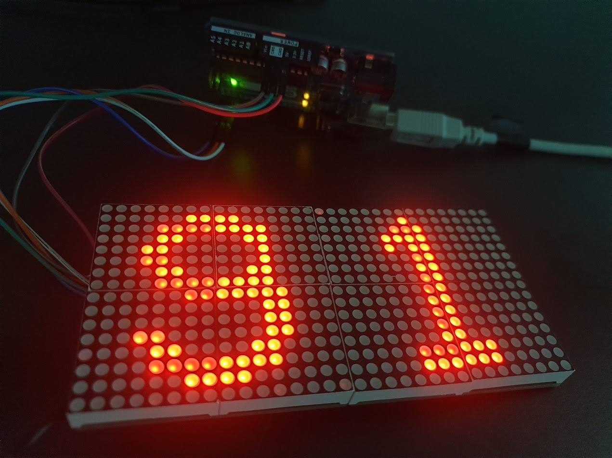

# Ledtrix a LED matrix module library

This is a firmware library for Ledtrix display module which is tileable 16x16 LED matrix. The KICAD project can be found at:

[Ledtrix KICAD](https://github.com/ts91/ledtrix)

It contains examples for driving the Ledtrix with an Arduino UNO (other boards will undoubtedly drive it just fine all the same). Included is a tool in [./generate](https://github.com/ts91/ledtrix-arduino/generate) for making new patterns. Each pattern can then be compiled into a frame, which is a bit patterns for the shiftregisters on the module. Multiplexing these bit patterns will light up the LEDs on the matrix drawn in the tool.

## Install (Arduino IDE)

1. Click Add .ZIP Library from Arduino IDE under Sketch > Include Library
2. The library will now be available in the Arduino IDE under Sketch > Include Library and examles are provided under File > Examples > Ledtrix

## TODO

- [ ] Make python script that extracts pin configurations directly from the KICAD file
- [ ] Get rid of awkward multi step process to generate pattern.c/h, maybe combine it all into the pattern_tool with javascript. Two views: left side is the graphical view of the matrix, right side is C-code for the pattern.

## Example

Below is an example of these Ledtrix modules. The LED brightness disparities is not as bad as it looks on camera, it not noticeable to the human eye.

